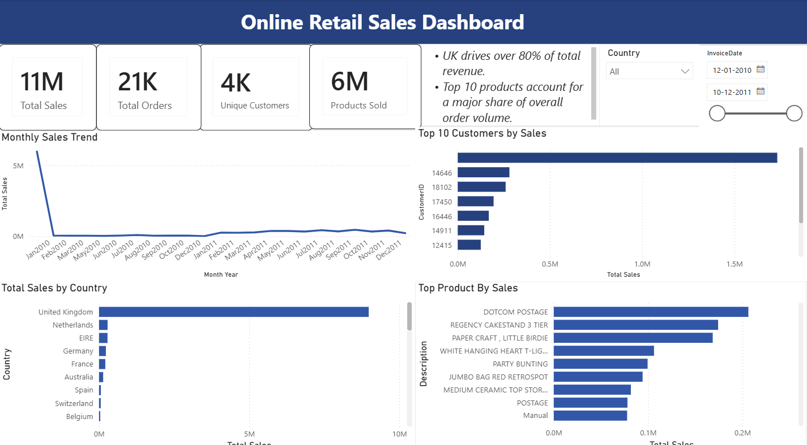

# Online Retail Sales Dashboard

## Project Overview
This project is an interactive Power BI dashboard built using the Online Retail Sales dataset. It provides insights into sales performance, customers, products, and countries.

## Dashboard Features
- Total Sales KPI
- Total Orders KPI
- Unique Customers KPI
- Products Sold KPI
- Monthly Sales Trend
- Top 10 Customers by Sales
- Top Products by Sales
- Total Sales by Country
- Country and Date Slicers

## Tools Used
- Power BI
- Power Query
- DAX
- Microsoft Excel

## Dataset
Online Retail Dataset (UCI Machine Learning Repository)

## Files Included
- Online Retail Sales Dashboard.pbix
- Online Retail Sales Dashboard.pdf
- Dashboard.png

## Dashboard Preview

## Key Insights
- United Kingdom contributes the highest revenue.
- A small number of products generate a significant portion of sales.
- Customer purchasing trends vary across months.
- Interactive filters allow analysis by country and date.
